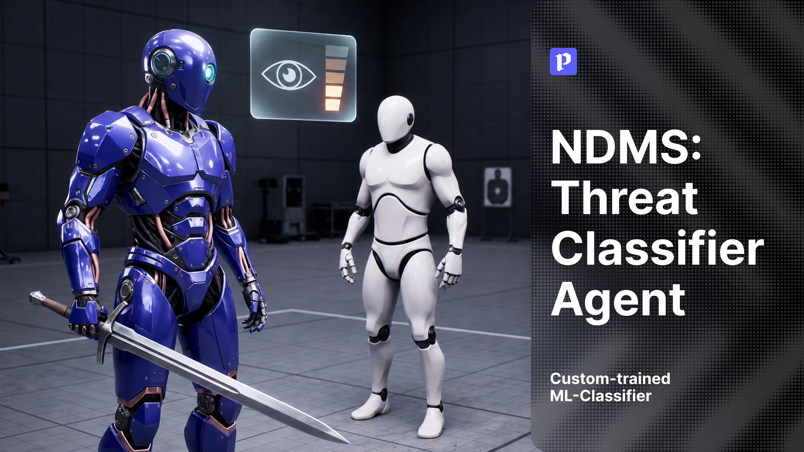

# NDMS: Классификатор угроз



<p align="center">
  
  
  
  <a href="https://www.fab.com"></a>
</p>

Классификатор угроз для Unreal Engine 5, заблаговременно оценивающий вероятность атаки игрока на NPC с помощью модели, обученной методом градиентного бустинга (XGBoost).

> [!NOTE]
> **Демо-версия для Windows 10/11.** Архив `Demo_ThreatClassifierAgent.zip` можно скачать в разделе [Releases](https://github.com/LLC-PANDORA/NDMS_ThreatClassifierAgent/releases/latest).

## Запуск демо

1. Скачайте `Demo_ThreatClassifierAgent.zip` на странице [Releases](https://github.com/LLC-PANDORA/NDMS_ThreatClassifierAgent/releases/latest).
2. Распакуйте архив в любую папку.
3. Запустите исполняемый файл `.exe` из распакованной папки.

## Мотивация

NPC, реагирующие на игрока по жёстким правилам (например, «оружие обнажено и дистанция меньше заданной»), ошибаются в неоднозначных ситуациях: игрок может подойти с мечом, чтобы поговорить, а возбуждённый после боя игрок – мирно пройти мимо. Кроме того, такие правила дают лишь бинарный ответ «угроза / не угроза», из которого невозможно построить плавное изменение поведения NPC. Описать все возможные комбинации признаков вручную слишком трудозатратно, а игрок быстро находит способ обмануть заранее прописанные условия.

Проблему решает модель, обученная на реальных игровых данных. Она оценивает не отдельные условия, а совокупность признаков поведения игрока и возвращает вероятность угрозы, на основе которой NPC постепенно меняет своё состояние.

## Как это работает

Модель решает задачу бинарной классификации намерения игрока с точки зрения конкретного NPC. Она отвечает не на вопрос «бьёт ли игрок прямо сейчас», а на вопрос «стоит ли NPC перейти в боевую готовность»: игрок с высокой вероятностью атакует в ближайшие 4 секунды. Это принципиально, поскольку NPC должен успеть среагировать до удара, а не в момент его нанесения.

На выходе модель возвращает вероятность угрозы, которая определяет одно из четырёх состояний NPC:

| Вероятность угрозы | Состояние NPC | Поведение |
|---|---|---|
| менее 0.5 | Idle | Спокойное состояние |
| 0.5 – 0.75 | Suspicious | Настороженность, наблюдение за игроком |
| более 0.75 | Combat | Боевая готовность |

Пороги являются ориентировочными и подбираются под конкретную обученную модель по ROC-кривой.

**Признаки.** Модель получает девять признаков, описывающих поведение игрока относительно NPC:

| Признак | Тип | Описание |
|---|---|---|
| distance_norm | вещественный | Нормализованная дистанция от игрока до NPC |
| speed_norm | вещественный | Текущая скорость игрока |
| facing_dot | [−1; 1] | Скалярное произведение направления взгляда игрока и направления на NPC |
| delta_dist_norm | [−1; 1] | Скорость изменения дистанции: сближение или удаление |
| weapon_equipped | 0 / 1 | Обнажено ли оружие |
| is_lock_on | 0 / 1 | Захвачен ли NPC в фокус внимания |
| adrenaline_norm | вещественный | Накопленный игроком адреналин |
| time_weapon_equipped_norm | вещественный | Как долго оружие остаётся обнажённым в текущем эпизоде |
| lock_on_duration_norm | вещественный | Как долго игрок удерживает фокус на NPC |

**Разметка данных.** Ручной разметки в проекте нет: метки проставляются автоматически по исходу эпизода, то есть по тому, чем закончилось взаимодействие игрока с NPC. Каждые 0.5 секунды состояние игрока записывается в буфер без метки, а затем метка определяется по событию:

| Исход эпизода | Метка |
|---|---|
| NPC получил урон от игрока | Все записи за предшествующие 4 секунды – «угроза» |
| Игрок открыл диалог с NPC | Все записи эпизода – «нет угрозы» |
| Игрок покинул зону NPC без конфликта | Все записи эпизода – «нет угрозы» |

Окно в 4 секунды определяется временем, которое необходимо NPC для физической реакции: инференс модели (около 1 с), переход в состояние готовности (около 0.2 с), анимация обнажения оружия (около 1.6 с) и запас (около 0.5 с).

**Данные.** Датасет собирается симуляцией разнообразных сценариев поведения игрока. Рядом с NPC расположены манекены, создающие неоднозначные ситуации, например игрок с мечом, идущий к манекену, а не к NPC.

| Группа сценариев | Метка | Примеры |
|---|---|---|
| Явная агрессия | угроза | Атака с захватом цели и без него, атака после боя с манекеном, спринт-атака, атака после паузы |
| Мирные, но неоднозначные | нет угрозы | Подход с мечом и последующий диалог, подход с высоким адреналином, отмена захвата цели, подход с мечом и отказ от атаки |
| Нейтральные | нет угрозы | Проход мимо NPC, ожидание на расстоянии, кратковременное обнажение оружия, стояние спиной к NPC |

При обучении выборка делится на обучающую и тестовую по эпизодам, а не по отдельным записям, чтобы исключить утечку данных. Дисбаланс классов устраняется уменьшением выборки мирных примеров до соотношения 2.5 к 1.

## Архитектура

Ниже показана архитектура ядра системы. В схему не включены вспомогательные компоненты: перемещение, здоровье, выносливость, адреналин, фокусировка на цели и другие. Они обеспечивают работу системы, но заменяемы и настраиваются независимо от её центральной части.

```text
        ┌────────────────────────┐
        │   Состояние игрока     │  Дистанция, взгляд, оружие,
        │   относительно NPC     │  фокус, адреналин...
        └───────────┬────────────┘
                    │ каждые 0.5 с
                    ▼
        ┌────────────────────────┐  Собирает признаки и формирует
        │   Сбор признаков       │  вектор из 9 значений
        └───────────┬────────────┘
                    ▼
        ┌────────────────────────┐
        │  Модель XGBoost        │  Вероятность угрозы
        └───────────┬────────────┘
                    │ вероятность
                    ▼
        ┌────────────────────────┐
        │  Пороги состояний      │  Idle / Suspicious /
        │                        │  Combat
        └───────────┬────────────┘
                    │ состояние
                    ▼
        ┌────────────────────────┐
        │  Поведение NPC         │  Реакция на игрока
        └────────────────────────┘
```

Контур сбора данных работает на этапе подготовки модели и устроен отдельно:

```text
  Снимки состояния ──► Буфер (0.5 с) ──► Событие исхода ──► Автоматическая метка ──► CSV
                                         (урон / диалог /
                                          уход игрока)
```

Сбор данных, разметка и симуляция выполняются в Unreal Engine 5 на Blueprints. Обучение модели и нормализация признаков выполняются в Python.

## Технологии проекта

| Компонент | Описание |
|---|---|
| Unreal Engine 5 (Blueprints) | Игровая логика, сбор признаков, симуляционная сцена, автоматическая разметка данных |
| XGBoost | Градиентный бустинг над решающими деревьями: модель оценивает вероятность угрозы по девяти признакам |
| Python | Подготовка датасета, нормализация признаков, обучение и оценка модели |
| Инференс в реальном времени | Обученная модель оценивает ситуацию во время игры и передаёт результат в логику состояний NPC |

## Статус проекта

Работоспособность системы проверена. Критических ошибок, влияющих на процесс обучения и принятие решений, не обнаружено.

Системе необходима дальнейшая полировка и развитие: расширение набора данных, добавление новых сценариев поведения игрока, уточнение набора признаков и порогов состояний, а также новые игровые механики для создания более широкого спектра ситуаций.

В перспективе возможна адаптация классификатора для нескольких NPC одновременно: сейчас модель обучена на поведении игрока относительно одного NPC, а взаимодействие нескольких NPC является отдельной задачей.

## Контакты и другие проекты

Если вы хотите связаться с нами или познакомиться с другими нашими проектами, заходите на сайт: **[pandora-llc.tilda.ws](https://pandora-llc.tilda.ws/)**

Полная версия системы с документацией скоро будет доступна на [Fab](https://www.fab.com).
